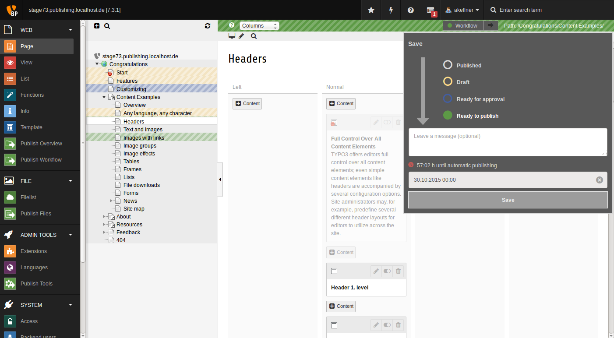
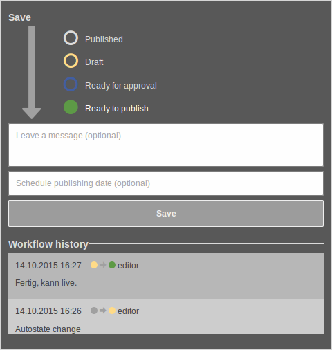

# Page module

If configured, a page can enter the workflow process automatically as soon as somebody makes a change on it (new record, moved record, deleted record, new page, change in page settings).

In this case it does not matter in which state the page is. If there is a new change, the workflow will begin anew.

Clicking on the workflow button will open the workflow menu. Clicking on the arrow within the workflow button will publish the page to the live system.

 

Note:

The arrow icon is only shown if

* there are changes, and
* the user has the right to publish, and
* the page has the workflow state "ready to publish" (or workflows are disabled completely).

 

## Workflow menu

 

The workflow menu is divided into two main areas:

* Change the workflow state of the current page
* See workflow history

### Change page state

* You can select a new page state (if you are allowed to change this).
* You can leave a message (optional).
* You can enter a scheduled publishing date for automatic publishing (if you are allowed to set this).

### Workflow history

See the history of all messages back to the moment where the page was published.
